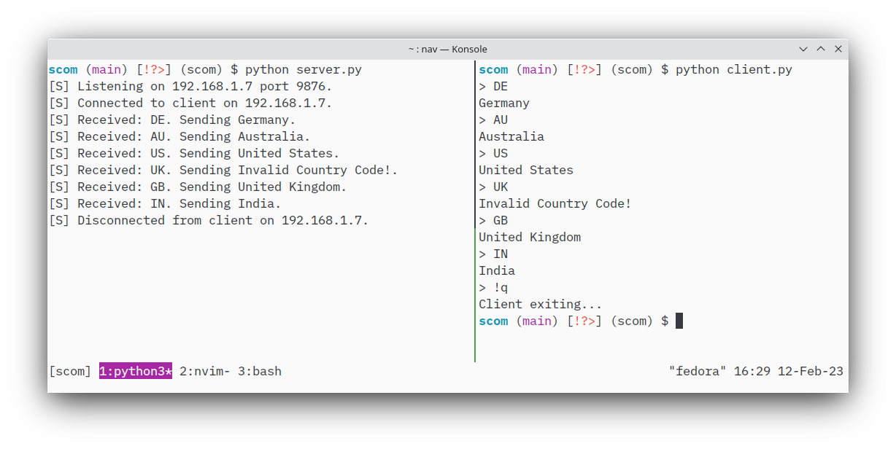

# Secure Communication (scom)
Encrypted communication between two processes through network sockets.

scom uses RSA keys to encrypt a session key before sending it to the clients.
The session key is then used to perfom AES encryption on every message that is exchanged between the servers and the clients.

## Screenshot

